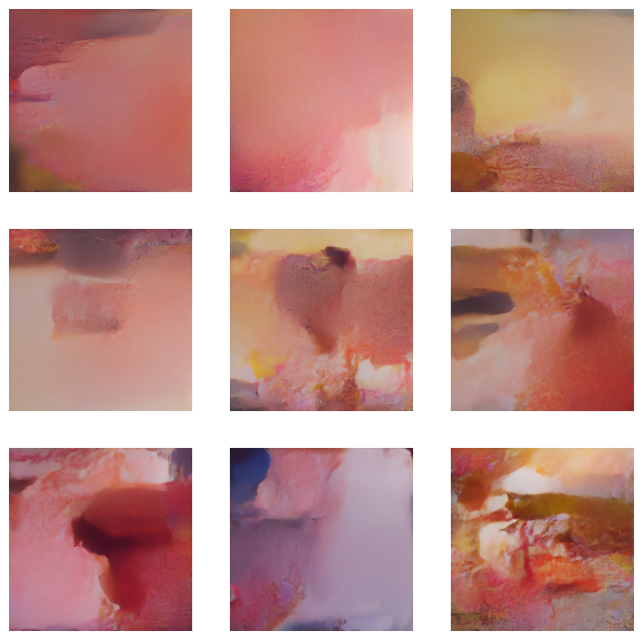
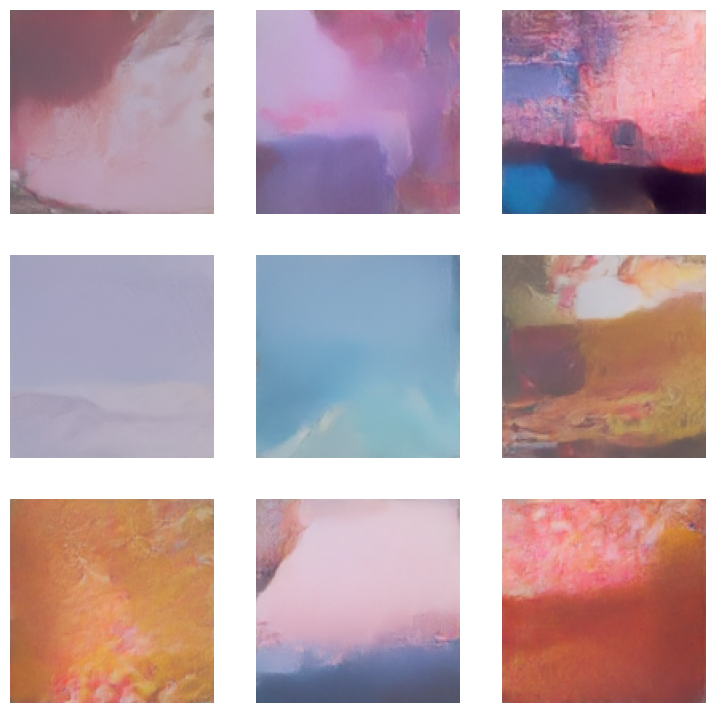

# Home-Made Diffusion Model

This project demonstrates a diffusion-based generative model that I built and trained entirely from scratch.  
The goal was to explore whether it is possible to design and train a functional diffusion model with minimal resources, while still producing images that carry some structure and coherence.

## Overview

- **Architecture**: Fully custom-built diffusion model.  
- **Dataset**: Scraped manually with a custom script (~400 MiB).  
- **Training**: Conducted on Kaggle with limited GPU resources.  
- **Results**: The model generates images at multiple resolutions (128p and 256p) that, while imperfect, display meaningful structure.

Preview samples:  
  

## Files

- `Full-Project.ipynb` – Main notebook containing model architecture, dataset preprocessing, and training pipeline.  
- `Inference.ipynb` – Script for running inference and generating new samples.  
- `Diffusion-Model-Trained-5h.pth` – Model checkpoint trained for 5 hours.  
- `Diffusion-Model-Trained-10h.pth` – Model checkpoint trained for 10 hours.  
- `preview-grid-1-256p.png`, `preview-grid-2-128p.png` – Generated image grids for visual evaluation.  
- `LICENSE` – Project license.  

## Usage

1. Clone the repository and open either notebook (`Full-Project.ipynb` or `Inference.ipynb`) in Jupyter or Kaggle.  
2. Load one of the trained checkpoints (`.pth` files).  
3. Run the inference script to generate new samples.  

## Motivation

Most diffusion models require massive datasets and compute power.  
This project aims to show that, even with constrained resources and a small dataset, it is possible to experiment with generative diffusion processes and obtain meaningful outputs.
